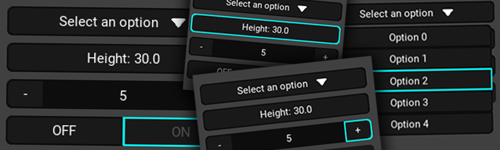

# Kivy Desktop

A collection of stylized widgets for creating visually appealing desktop applications with Kivy.



## Features

- **DButton**: Customizable buttons with icon support, different styles, and hover effects.
- **DNumeric**: Numeric control with adjustment via drag, text input or +/- buttons.
- **DSpinner**: Stylized dropdown menu.
- **DSwitch**: Stylized ON/OFF switch.
- **DScrollView**: Enhanced scroll view for desktop applications.
- **DTextInput**: Disable all default text input behavior.
- **DBoxLayout**: Stylized box layout with border and background customization.
- **DNamedWidget**: A widget with a name attribute for easy identification.
- **Popup**: Simple popup with customizable title and message.
- **ColorSelector**: Color selector widget with RGB and HSV inputs.
- **Theme**: Theme system with customizable colors.

## Installation

### From Source
1. Clone the repository:
```bash
git clone https://github.com/offerrall/KivyDesktop
```

2. Navigate to the project directory:
```bash
cd KivyDesktop
```

3. Install the package:
```bash
pip install .
```

Or install in development mode:
```bash
pip install -e .
```

```bash
pip install -r requirements.txt
```

## Example Usage
For a simple example of how to use the widgets, check out the `example.py` file in the repository.

## Some Widget Components

### DButton
```python
button = DButton(
    text="Click me",                     # Button text
    icon_source="path/to/icon.png",      # Optional icon
    icon_placement="left",               # Icon position ("left" or "right")
    content_alignment="center",          # Text alignment ("left", "center", "right")
    release_callback=my_function,        # Function to call when button is released
    background_color=[0.1, 0.1, 0.1, 1], # Background color
    font_color=[1, 1, 1, 1]              # Text color
)
```

### DNumeric
```python
numeric = DNumeric(
    value=50,                            # Current value
    min_value=0,                         # Minimum value
    max_value=100,                       # Maximum value
    step=1,                              # Step size
    use_float=False,                     # Use floating point values
    float_precision=2,                   # Decimal places (if use_float=True)
    on_change_callback=my_function       # Function to call when value changes
)
```

### DSpinner
```python
spinner = DSpinner(
    text="Select option",                # Current selection text
    values=["Option 1", "Option 2"],     # Dropdown options
    on_select_callback=my_function       # Function to call when selection changes
)
```

### DSwitch
```python
switch = DSwitch(
    value=True,                          # Current state
    on_text="ON",                        # Text when switch is ON
    off_text="OFF",                      # Text when switch is OFF
    on_change_callback=my_function       # Function to call when state changes
)
```

### DScrollView
```python
scroll = DScrollView(
    orientation="vertical",              # Scroll direction
    spacing=10,                          # Spacing between children
    padding=10,                          # Padding around content
    auto_adjust_height=True              # Auto-adjust height based on content
)

# Add widgets to scroll view
scroll.add_widget(my_widget)
```

### DBoxLayout
```python
box = DBoxLayout(
    orientation="vertical",               # Layout orientation
    background_color=[0.2, 0.2, 0.2, 1],  # Background color
    background_radius=[6, 6, 6, 6],       # Corner radius
    border_line_width=1.2,                # Border width
    border_color=[0.05, 0.05, 0.05, 1],   # Border color
    padding=[10, 10, 10, 10]              # Internal padding
)

# Add widgets to the box layout
box.add_widget(my_widget)
```

## Customizing Themes

You can customize the theme colors by modifying the `COLORS` dictionary:

```python
from kivy_desktop.theme import COLORS

# Override default colors
COLORS['back1'] = [0.15, 0.15, 0.15, 1]  # Slightly lighter background
COLORS['seleted'] = [0, 0.8, 1, 1]       # Different highlight color
```

## Requirements

- Python 3.9+
- Kivy 2.0.0+

## License

[MIT](LICENSE)